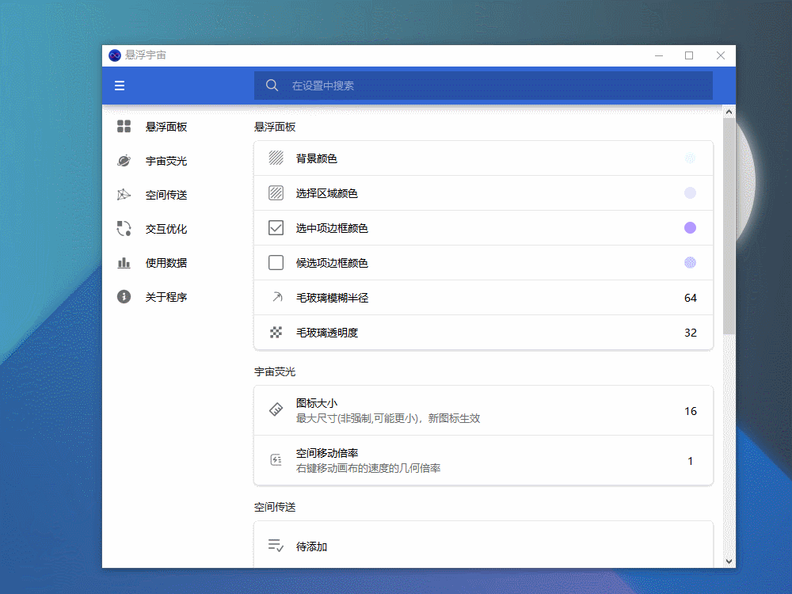
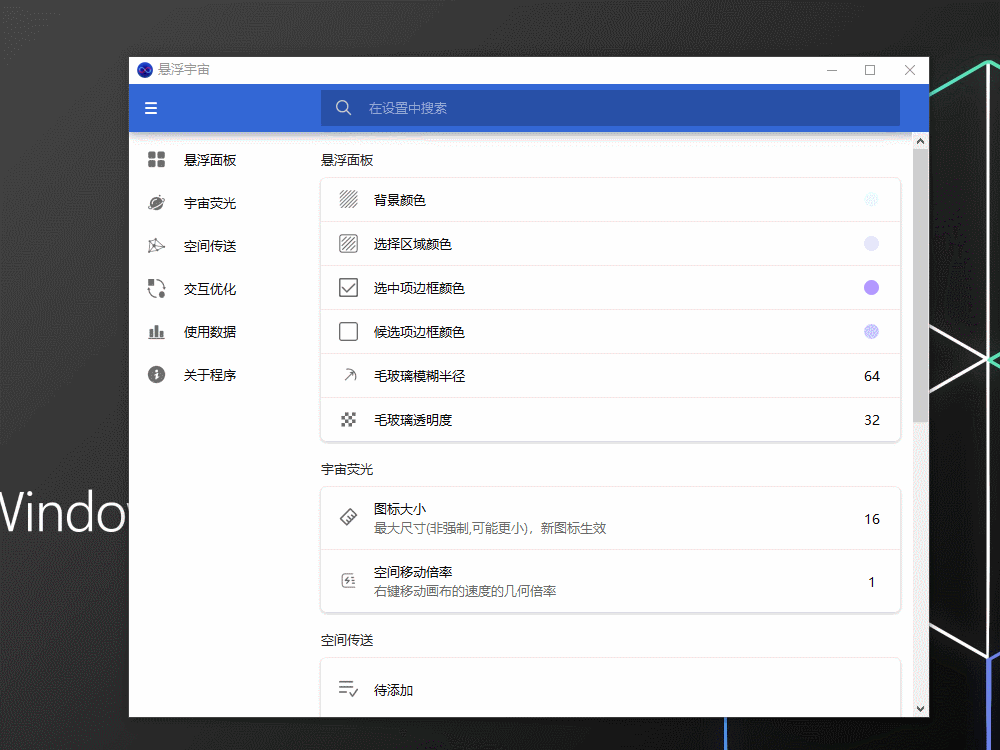
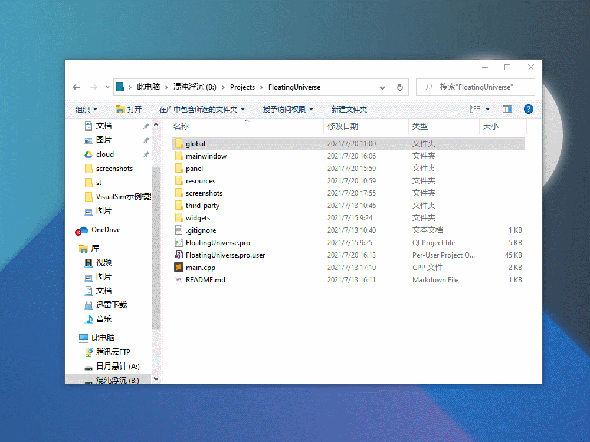
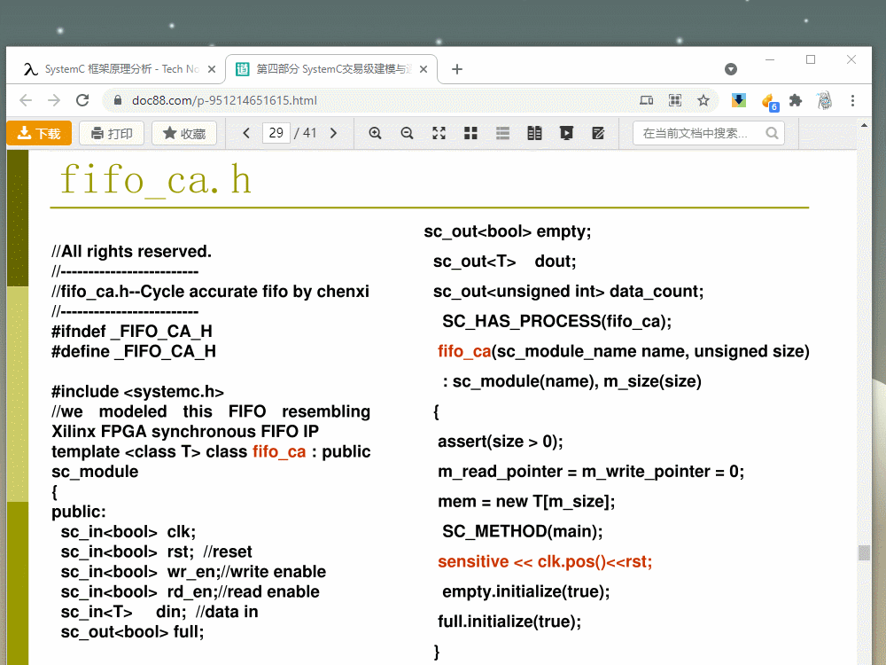
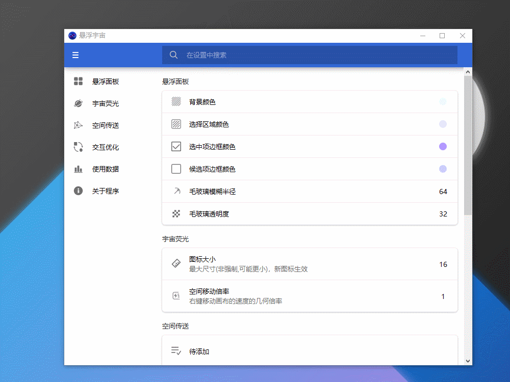
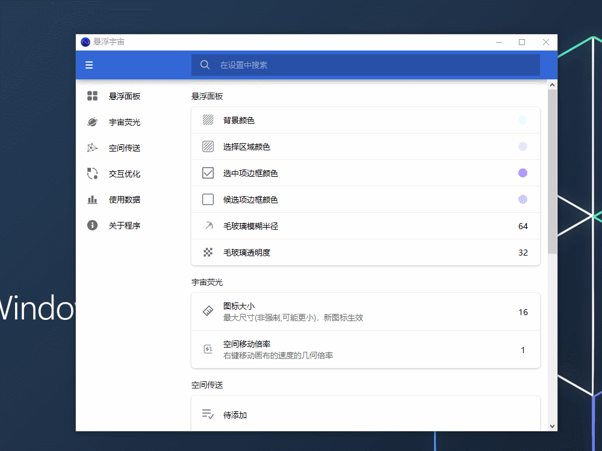
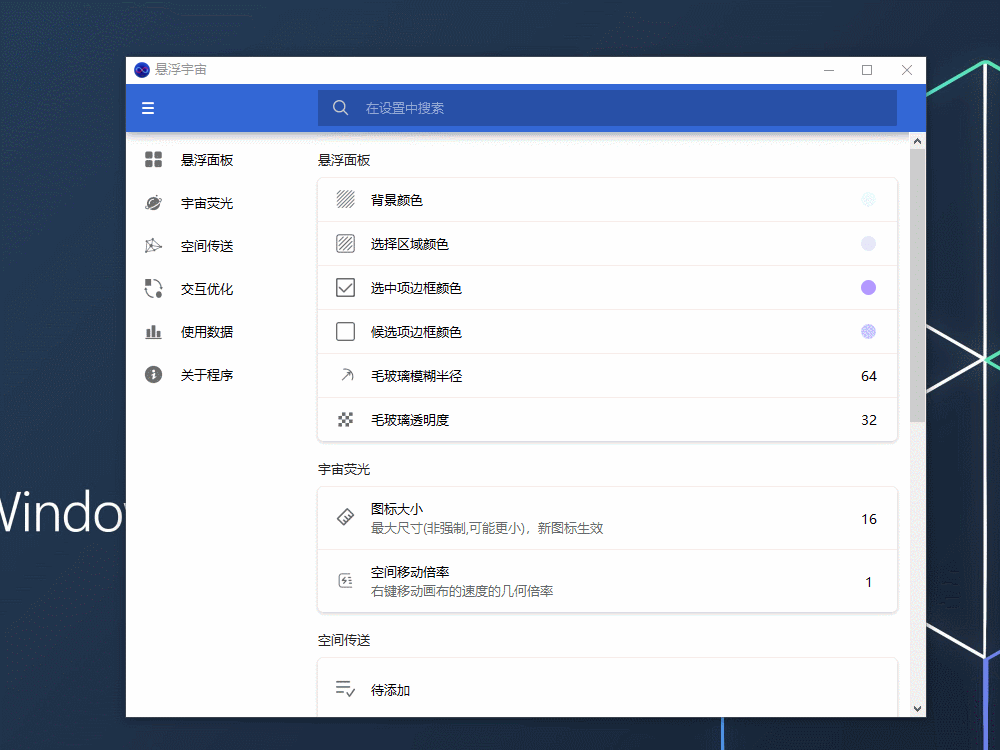

悬浮宇宙
===

桌面悬浮窗软件，可放置文件、网址、文字等多样内容，鼠标贴近屏幕顶边自动呼出。

其特点是**无限尺寸**的画布，如同浩瀚无垠的宇宙，可容纳不限量的数据。

界面简约，动画俏皮，功能丰富，效果甚佳。


## 功能

当前支持的部件类型：

- 文件（快捷方式）
- 文件夹（快捷方式）
- 网站URL（书签）
- 纯文本（速记）
- HTML
- 待办（TODO）
- 图片
- 文件
- 文件夹
- 图片装饰
- 分组小部件


未来计划：

- 导入桌面
- 闹钟提醒
- 传送阵（位置跳转）
- 剪贴板快速触发执行


## 截图


## 操作说明

### 靠边自动唤出

默认位置是屏幕上方边缘，鼠标移到顶出现悬浮面板，鼠标离开自动隐藏。




### 调整位置和大小

悬浮面板的右键菜单中，点击“**固定**”后，面板则不会自动隐藏，可调整位置和大小。

再次点击“固定”，结束调整，继续自动隐藏。




### 添加文件链接

资源管理器中**拖拽文件、文件夹**进来，支持批量添加。

程序会自动获取文件图标和名字，也可手动修改。




### 快速更新文件链接

与添加一样，将资源管理器中的文件**拖拽到相应的图标上**，完成链接更新。

目前仅支持单个替换，对于无法响应的动作（例如图中的多个文件），图标将会轻微震颤。


### 添加和更新网页书签

网页书签和文件一样，在浏览器地址栏中**将网址拖入**，或者**拖到现有图标上**更新链接。

添加时，程序会自动获取网页的图标和标题。




### 添加图像

支持**粘贴**剪贴板的图像，自由调整大小。




### 添加分组背景

为同一类的文件/文件夹/网页添加分组，优化视觉效果。

通过**添加“矩形”**，将之“置于底层+不被选中”，可实现该功能。


### 添加装饰部件

可添加一些用于装饰的小图标，悬浮在面板上。




### 添加装饰背景

可添加一些透明的小图片，置于底层，作为背景装饰。




### 快捷键

- `Ctrl+A`：第一次全选可选中的（不包括设置“不被选中”）的部件；连续的第二次全选所有部件
- `Delete`：删除选中项


### 设置样式

绝大多数部件都可以设置CSS样式，但**并非所有部件、所有样式都可使用**，有些属性需要**重启生效**，请自行测试。

以下是一些对象名字代码，在选择器中使用形如 `#IconLabel{ }` 来设置具体对象，可参考下面一些示例。

- 基类

  - ItemBase：所有部件的基类，但莫名无效

  - SelectEdge：边缘，需要重启才生效

    ```css
    /* 设置选择框为红色 */
    #SelectEdge{ border: 1px solid #AA0000;}
    ```

- 链接

  - IconLabel：图标部分
  - TextLabel：文字部分

  ```css
  /* 设置图标背景颜色 */
  #IconLabel { background: white; border-radius: 5px; }
  ```

- 文本

  - TextEdit

    ```css
    /* 设置文字为蓝色 */
    #TextEdit{ color: blue; }
    ```

- 待办

  - ListWidget：整个列表控件
  - TodoLine：每一行整体
  - TodoCheck：每一行的选择框
  - TodoEdit：每一行的编辑框

- 图像

  - ImageLabel：没必要，只是个图片

- 矩形

  - 使用 ItemBase，或干脆不用选择器（但是 ItemBase 无效）


一些注意点：

- “矩形”部件设置CSS后，将**完全替代**原本的圆角矩形；但是设置背景颜色无效，因此显示不出来。