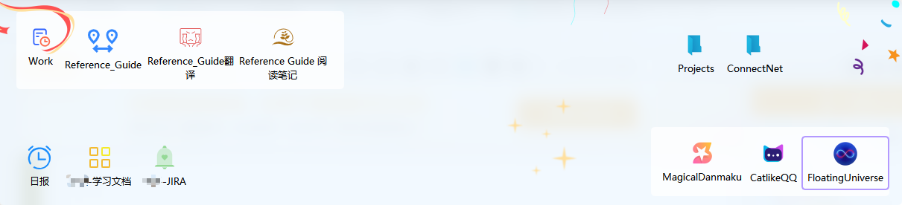
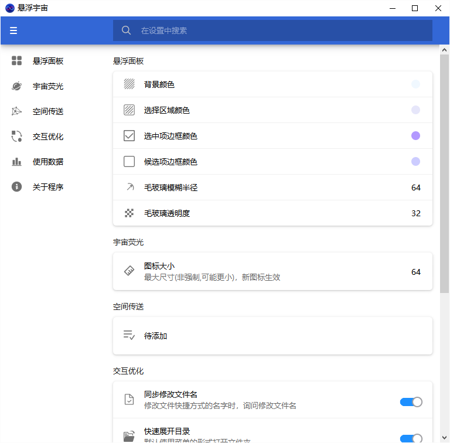

悬浮宇宙
===

桌面悬浮窗软件，藏在屏幕上边缘，鼠标贴近自动呼出。

可放置文件、网址、文字等多种内容到上面，生成对应的快捷功能。

其特点是**无限尺寸**的画布，如同浩瀚无垠的宇宙一般，可容纳无数内容（只要电脑存得下）。

界面简约，动画俏皮，功能丰富，效果甚佳。

## 功能

支持放置类型：

- 文件（快捷方式）
- 文件夹（快捷方式）
- 网站URL（书签）
- 纯文本（快速笔记）
- HTML
- 图片
- 文件
- 文件夹
- 图片装饰
- 分组小部件

未来计划：

- 待办
- 提醒
- 传送阵（位置跳转）

## 截图

